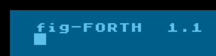

# "Forth-Atari": source code snippets for Atari 8-bit computers

## TL;DR

A collection of fig-Forth code snippets, tools, editors, experiments, and oddities for Atari 8‑bit systems—mostly targeting APX Extended Fig-Forth. Everything comes from old type‑in listings, so expect quirks, broken bits, and nostalgia. Use an emulator (Altirra recommended), not real hardware, unless you enjoy surprises.

## No, really, what is this?

This repository contains different snippets of code implemented in fig-Forth - useful words, data structures, utilities and "stuff" - mainly for Atari 8-bit and the "APX Extended Fig-Forth" by Patrick Mullarky. Despite being a faithful implementation of the FIG "model", APX Forth was nearly never used for commercial purposes, unlike its successor, valForth. Neither was immensely successfull but both deserve being remembered.

Fig-Forth was a "model", described in a standard-like document and sources for multiple microcomputers, popular in the beginning of the 1980s. 

Read about history of Forth [here](https://www.forth.com/resources/forth-programming-language).

## Why would I need it?

If you know, you know.
## How to use these source files?

Any information where the code came from and its possible issues, are mentioned in the comments. I give no guarantee that anything published here will work safely for you - and I especially recommend NOT TO RUN any of it on a real Atari hardware without heavy testing.

All the code comes from type-in listings, published mostly in "Forth Dimensions",  "Micro 6502" or "Tajemnice Atari" in the 1980s and 1990s - so typically are in the public domain or otherwise "free-like". The license was not explicitely stated but the intention was clearly similar to contemporary MIT and in the spirit of fig-Forth. 

The most unstable snippets are in the "drafts" folder and may be in a completely broken state.

Recommended method of using the code snippets:
- check the comments and understand the general concept of the code
- start Atari emulator (Altirra recommended), use atarixl.rom, disable Basic, potentially change the disk saving mode (perhaps to R/W - please check the emulator's manual)
- boot Forth (usually APX Forth)
- paste code into Altirra and test
- if you can't paste the code (i.e. not using Altirra), it has to be converted to an ATR file and connected as a floppy (could be the second one, with the first one being the Forth); scripts present in the "pc-tools" folder may help you

In some cases the code is prepared for storage on the "source screens" and it has to be put on the floppy / ATR by using the FIG editor commands. To see what I mean, check "editors/edit.4th". In any case, running some of the code snippets will not be straightforward.

When in doubt, raise a ticket!
## How to obtain APX Forth?

Er, I knew but forgot... perhaps, buy it on eBay?

## What EXACTLY are the sources?
### ["/asm"](/asm) - snippets of the Forth Assembler code

* LINER2 - shows a line on the screen and allows to move it down (with Help) or up (with Shift-Help); this is a slightly extended port from a machine code application written by Marek Omirski and published in "Bajtek"
* I put here my minor experiments with Forth Assemblers (typically with the Ragsdale Assembler)

### ["/debug"](/debug) - debugging tools

* BREAK&GO - adding breakpoints and starting an internal interpreter to better debug your fig-Forth code
* QMEG - call a machine language monitor, Self Test or QMEG
* STACK-PROMPT - enable or disable stack display

### ["/dictionary"](/dictionary) - manipulating the Forth dictionary

* NAMESPACES - a (failed) attempt to have vocabularies working more like real namespaces 
* RECOLON - redefining a colon word is a great method, allowing to reconnect a more recent definition to its previous version - and to avoid FORGETing and recompiling parts of the dictionary
* TRANSIENTS - temporary (disposable) areas of the dictionary; a typical usage would be to load there development tools (assembler, debugging words, editor) and remove them when no longer needed, without recompiling the rest
* VOCABULARIES - showing that vocabularies allow multi-level inheritance (kind of)
* WHERE-USED - identifying uses of a word, very useful when modifying the language

### ["/docs"](/docs) - miscelleneaus documentation

* ATARI-CONCEPTS - a mysterious description of Forth usage in Atari Coin-Op department as a means of game debugging; extracted from the file: "figasm, f69asm, computype master.atr" originally present at "http://annex.retroarchive.org/disks/Atari/Forth-Disks/"; the file is not converted correctly yet (missing inverse) and it is not clear whether it describes an unrealized concept or something which was actually used

### ["/drafts"](/drafts) - unstable but potentially interesting 

* work in progress, usually not working - failed attempts to run or port Forth code, broken data structures, crashing tools and procedures, unfinished type-in conversions...
* when stabilized, code is moved to other (relevant) folders

### ["/editors"](/editors) - source code editors

* EDIT - a very nice (even if slow, as it's written only in Forth) screen editor, written by M. Dougherty
* EDYTOR-FORTH - a very fast and modern (even if allowing editing of only one screen at once) screen editor by R. Pantola; includes (as a prerequisite) slightly tuned "Ragsdale Assembler" and Roland's "Edytor Wprowadzania" ("Entry Editor" - used to check control codes for type-in programs); contains a clipboard with a ring buffer; Esc-Space exits (without saving)
* EWK - "Edytor Wyswietlania Kodow" ("Code Display Editor") - control code generator by R. Pantola, supplementary to the above mentioned "Edytor Wprowadzania" and allowing to generate control codes for single lines of Forth code
* FIG-MINI - smallest useful subset of the FIG line editor (contains only Put and Erase)
* MTF - this is Micro Text Formatter by Robert La Quey, a small tool to store slightly formatted text on Forth screens

### ["/games"](/games) - very simple games and demos

* ESCAPE - a conversion (by John Mattes) of a small graphical demo, wirtten by an unknown author
* LIFE - a super-slow implementation of Life from the book "Forth" by Salman, Tisserand and Toulout
* MUGWUMP - a conversion (from the Basic language) of an ancient logical game, enhanced by me with some graphics
* Mugwump-240816.atr - above, bootable

### ["/io"](/io) - external device management (drives etc)

* DISKCOPY - a disk copy routine from Space Forth, not included later in APX Forth
* DISKSIMUL - ram disk simulation from the fig-Forth installation guide

### ["/mods"](/mods) - modifications of major words

* BLIST - a better (?) LIST, trying to show both screens with sources and blocks with binary data
* CASEINS - making the interpreter case-insensitive (ported from pns-Forth)
* COMPENT-XLIST - "compiled comments" as a wasteful way to document words in-memory; XLIST is a VLIST, showing extended word info (with immediate/smudge bits, with CFA references and these "compiled comments" as well); APX's DECOMP modification is also described here not to break it completely with the compiled comments
* MESSAGE - static error messages to avoid reading from the floppy
* PICK&ROLL - tricky stack operations PICK and ROLL

### ["/pc-tools"](/pc-tools) - file format conversion scripts

* FS2ATR - a script by Buki to potentially convert Forth source files from PC into ATR images, may work in some cases
* TXT2SCR - my attempts to solve the same problem (an in reverse), may work in some cases

### ["/spin-offs"](/spin-offs) - modifications of Forth environments

* IDE-SRC.* - routines to transform APX Forth floppy image into a more contemporary environment, suitable for Forth studies and small development tasks; includes source editing and debugging tools; contains help
* IDE-BOOT.ATR - the modification itself, ready to be booted and played with - see the dedicated [README.md](spin-offs/README.md) for details

## ["/variables"](/variables) - less usual ways to define variables

* ANON - anonymous variables by Leonard Morgenstern, published in Forth Dimensions
* ARGRES - simple but useful local variables by Marc Perkel, published in Forth Dimensions as "Turning the Stack into Local Variables"
* DEFER-IS - example of "deferred words" (vectored execution), based on Henry Laxen's code published in Forth Dimensions
* LOCALS-MINI - my attempt to implement local variables; too many limitations to be practical
* LOCALS-STACK - local variables as described by Baranov & Nozdrunov in "Language Forth and its Implementations"
* MAP - a simple map-like data structure (apply a function when fetching an element of an array)
* SEQUENCE - a simple Oracle sequence-like data structure (increase variable when fetching), also similar to ++ from C
* STRINGS - multiple (not always consistent) concepts how to handle text strings 
* TABLE-LOOKUP - table lookup example by Henry Laxen, as published in Forth Dimensions

