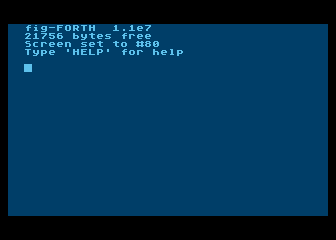
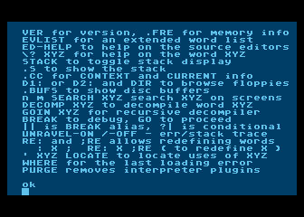
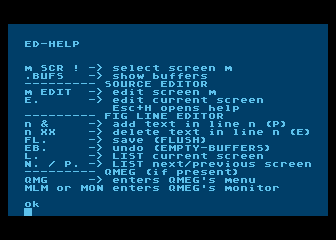
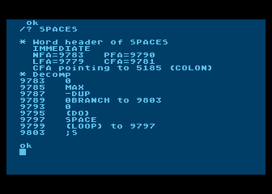
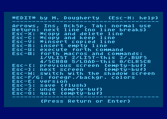

# Study-oriented APX fig-Forth modification for 8-bit Atari

## How to Run

1.  **Emulator Setup:** Use an Atari 8-bit emulator (e.g., **Altirra**) configured with an **Atari XL/XE ROM**.
2.  **Booting:** Mount and boot from `IDE-BOOT.ATR`.
3.  **Interaction:** Once the banner appears, you are in the Forth interactive environment.

## Features

### 1. Informative boot banner
Displays version and some hints upon startup.

### 2. Built-in help system
Words `HELP` and `ED-HELP` explain usage of the most useful tools.

### 3. Integrated word inspector (`/?`)
A combined word-header viewer and decompiler. Use `/? <wordname>` to inspect the dictionary entry and logic of any word.

### 4. Full-screen editor
Includes a modified version of the editor published in "Micro 6502".

---

## How to rebuild the system
*Use these steps if you want to build the bootable file similar to IDE-BOOT.ATR.*

1.  **Initialize:** Boot the vanilla APX Forth ATR (not included).
2.  **Load Dependencies:** Enter the following to load the out-of-the-box debugging words, assembler, and graphics support:
    `: CORE ; 21 LOAD 40 LOAD 50 LOAD`
3.  **Insert Source Disk:** Swap the disk image to `APXFORTH-IDE.ATR` (or its physical sector-copy made via DISKCOPY or QMEG).
4.  **Compile:** Enter `1 LOAD` to begin the build process.
5.  **Save Image:** * Once the compilation finishes, insert an empty, formatted Single Density (SD) disk and press **Return**.
    * *Alternatively:* You can skip swapping the floppy and overwrite `APXFORTH-IDE.ATR` with the new Forth version.

---

## How to modify the source 
*Follow these steps to edit the code on a modern PC before injecting it into the Atari environment.*

1.  **Locate Source:** Navigate to the `spin-offs` folder in the cloned repository.
2.  **Edit:** Modify `APXFORTH-IDE.4TH` using your preferred text editor.
3.  **Convert:** Run the conversion script in bash:
    `./txt2scr.sh APXFORTH-IDE.4TH`
    *(This converts the text file into the screen-block format required by Forth.)*
4.  **Rebuild:** Follow the **"How to Rebuild the System"** steps above using your newly generated `APXFORTH-IDE.ATR`.
